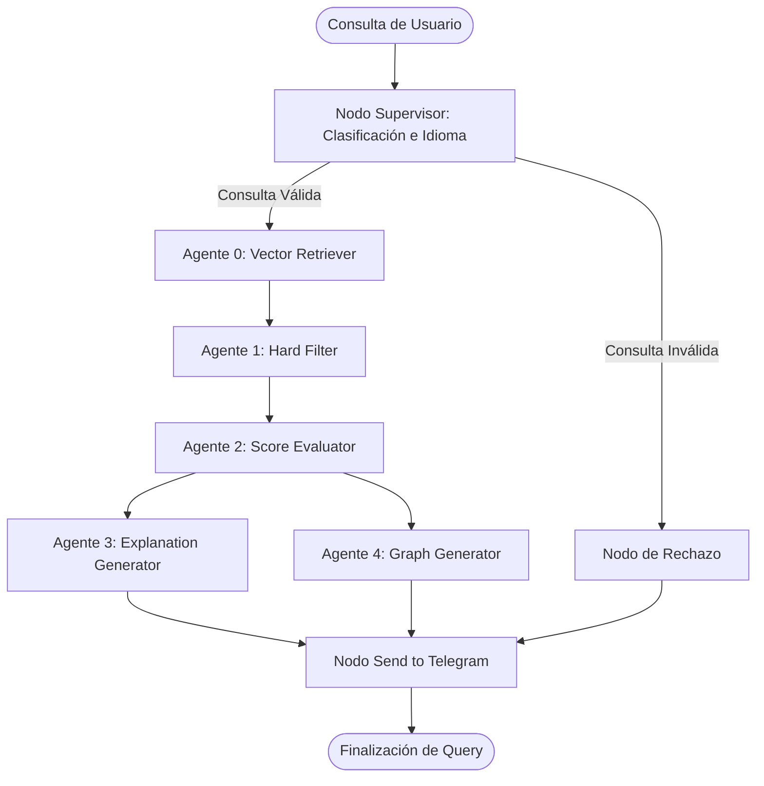
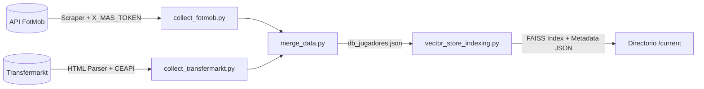

# 📐 Especificación Arquitectónica — ScoutingInteligente

Este documento proporciona una descripción técnica detallada del diseño de software, algoritmos y flujos de datos que componen el sistema **ScoutingInteligente**. Su propósito es servir como referencia para desarrolladores e investigadores académicos (Tribunal de TFM) que requieran comprender las decisiones de diseño e implementaciones matemáticas del proyecto.

---

## 🤖 1. Arquitectura de Orquestación Multiagente (LangGraph)

El núcleo del bot opera como un **Grafo Acíclico Dirigido (DAG)** orquestado a través de **LangGraph**. A diferencia de los pipelines tradicionales y secuenciales, esta estructura permite una mutación controlada del estado del sistema (`PipelineState`) mediante nodos especializados que actúan de forma coordinada.

### Grafo de Flujo de Datos

### Gestión del Estado Compartido (`PipelineState`)
El grafo comparte un estado común de tipo `TypedDict` que se actualiza de forma aditiva:
* `query`: Texto de la consulta original.
* `lang`: Idioma detectado.
* `tipo`: Clasificación de demarcación (`jugador` | `portero`).
* `df_pre_filtrado`: Polars DataFrame con los candidatos crudos recuperados.
* `df_filtrado`: Polars DataFrame tras la aplicación de filtros restrictivos.
* `resultados`: Estructura JSON/Python con el Top-3 de candidatos y sus métricas.
* `df_top3`: Polars DataFrame del Top-3 para la visualización.
* `explicacion`: Texto en lenguaje natural justificado por el LLM.
* `chart_paths`: Rutas de las imágenes PNG/JPG generadas para el envío.

---

## 🔍 2. Mecánica de Recuperación (RAG) y Espacio Vectorial

El sistema implementa una arquitectura RAG para solventar búsquedas cualitativas en lenguaje natural (ej. *"un extremo regateador y con desborde"*).

### Fórmulas y Modelos
1. **Generación de Embeddings**: Se utiliza el modelo multilingüe `intfloat/multilingual-e5-base` (SentenceTransformers), el cual genera vectores densos de $d = 768$ dimensiones.
2. **Representación de Documentos**: Cada jugador se transforma en un documento de texto plano concatenando sus atributos semiestructurados mediante la función `jugador_to_text()` (nombre, equipo, edad, pie dominante, estadísticas principales y rasgos).
3. **Métrica de Distancia Vectorial**: 
   Los vectores tanto del documento ($d_i$) como de la consulta ($q$) se normalizan en la esfera de radio 1 ($L_2$ normalized):
   $$\|d_i\|_2 = 1, \quad \|q\|_2 = 1$$
   
   Al estar normalizados, el **Producto Interno (Inner Product)** calculado en el índice FAISS (`faiss.IndexFlatIP`) equivale exactamente a la **Similitud del Coseno**:
   $$\text{Similitud}(q, d_i) = q \cdot d_i = \cos(\theta)$$
   
   El Agente 0 recupera los $k = 3500$ candidatos con mayor puntuación de similitud para alimentar los siguientes nodos.

---

## 📊 3. Algoritmo de Puntuación Personalizada (Agente 2)

El Agente 2 es el núcleo analítico del sistema. Su trabajo consiste en evaluar de forma cuantitativa a los candidatos filtrados asignándoles un score de $0$ a $100$.

### Algoritmo de Selección de Métricas
Para cada query, el sistema selecciona de manera dinámica **8 métricas estadísticas** relevantes mediante un enfoque híbrido:
1. **Intent Semántico (70% de peso)**: Mapeo manual predefinido de familias estadísticas a conceptos comunes del fútbol (centros, gol, distribución, juego aéreo, etc.).
2. **Similitud Semántica de Atributos (30% de peso)**: Se calcula la similitud coseno entre el embedding de la query y las descripciones conceptuales de cada métrica en la base de datos.
3. Se seleccionan las 8 métricas con mayor puntuación compuesta, aplicando desduplicación inteligente (ej. evitar evaluar simultáneamente `Duels won` y `Duels won %`).

### Fórmula del Score
Para un jugador $j$ y una métrica $m$, el score de la métrica ($S_{j,m}$) combina el percentil bruto del jugador en su base de datos ($P_{j,m}$) y su rendimiento ajustado por 90 minutos ($P^{90}_{j,m}$):

$$S_{j,m} = w_{pct} \cdot P_{j,m} + w_{90} \cdot P^{90}_{j,m}$$

* **Normalización por Minutos**: Si el jugador posee menos de $750$ minutos jugados, se priorizan las métricas por 90 minutos para evitar sesgos de volumen:
  $$\text{Si } \text{Minutos} < 750: \quad w_{pct} = 0.3, \quad w_{90} = 0.7$$
  $$\text{Si } \text{Minutos} \ge 750: \quad w_{pct} = 0.7, \quad w_{90} = 0.3$$

* **Ajuste de Dificultad Competitiva (Coeficiente de Liga)**:
  El score agregado final del jugador ($Score_j$) se multiplica por un coeficiente que refleja la competitividad de su liga ($C_{liga} \in [0.85, 1.00]$):
  
  $$Score_j = C_{liga} \cdot \sum_{m=1}^{8} \left( W_m \cdot S_{j,m} \right)$$
  
  Donde $W_m$ es el peso específico asignado a la importancia de la métrica $m$ en la query (renormalizado a $\sum W_m = 1$).

---

## 🗃️ 4. Pipeline de Datos y ETL

El pipeline ETL extrae, procesa y unifica los datos históricos y estadísticos de dos fuentes externas:

### Optimizaciones Clave del Scraper
* **FotMob ETL**: Requiere la inyección manual del `X_MAS_TOKEN` dinámico en `.env` debido a los mecanismos de protección de la API de FotMob.
* **Transfermarkt ETL**: Rediseñada para realizar 1 única petición HTML principal complementada con 2 llamadas de API interna (CEAPI). Emplea un sistema global de **RateLimiter** que reduce los tiempos de rastreo por liga de **8 horas a menos de 20 minutos**, evitando baneos de IP.

---

## 🧪 5. Marco de Evaluación y LLMOps (Promptfoo)

Para garantizar la estabilidad del sistema durante la experimentación académica de modelos, se implementa una matriz de evaluación con **Promptfoo** configurada en `promptfooconfig.yaml`.

### Matriz de Pruebas
Se componen ejecuciones automáticas cruzando:
* **Proveedores de LLM**: OpenAI (ej. `gpt-4o-mini`, `gpt-4o`) vs Groq (ej. `llama-3.3-70b-versatile`).
* **Test Cases**: 10 preguntas estandarizadas del Anexo D del TFM, incluyendo búsquedas relacionales complejas y casos límite (ej. buscar "LeBron James" o un portero que meta 20 goles).

### Mecánica de Evaluación (LLM-as-a-Judge)
Promptfoo levanta de manera concurrente el pipeline del bot mediante `scouting_provider.py`. La salida es evaluada por un modelo evaluador (`gpt-4o`) con un prompt de rúbrica académica estricto que evalúa en una escala de aprobación binaria (PASA/FALLA) basada en:
1. **Tono Profesional**: Estilo formal de analista técnico de fútbol.
2. **Fundamentación Física**: Ausencia de alucinaciones; todas las afirmaciones deben estar respaldadas por métricas de la base de datos.
3. **Interpretación de Percentiles**: Coherencia en métricas con connotaciones negativas (ej. pérdidas de balón, regates sufridos).
4. **Adecuación**: Ajuste a filtros de edad, valor y posición declarados.
