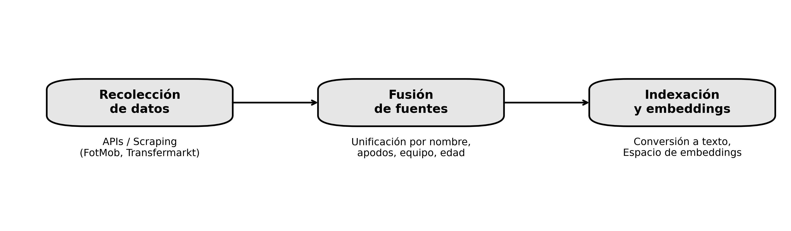
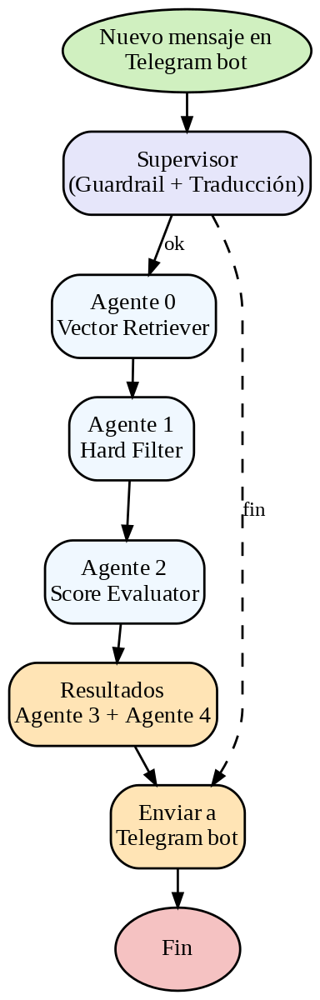
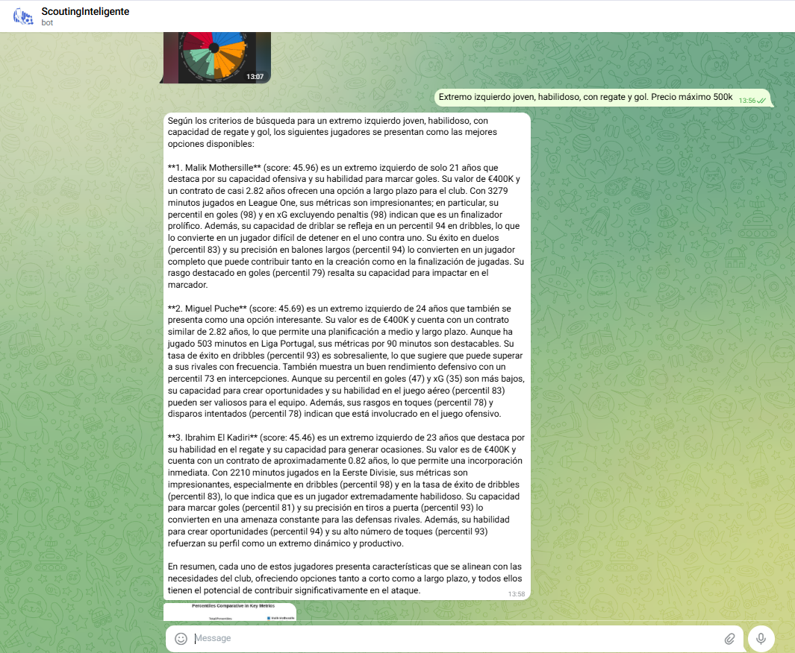
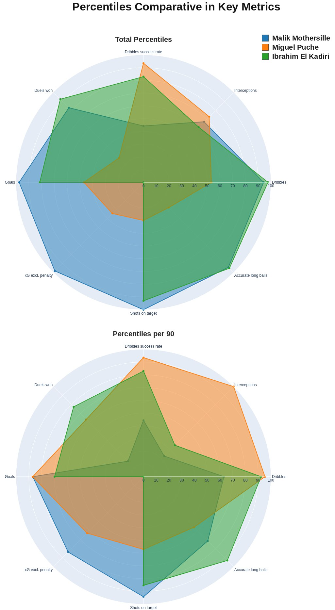
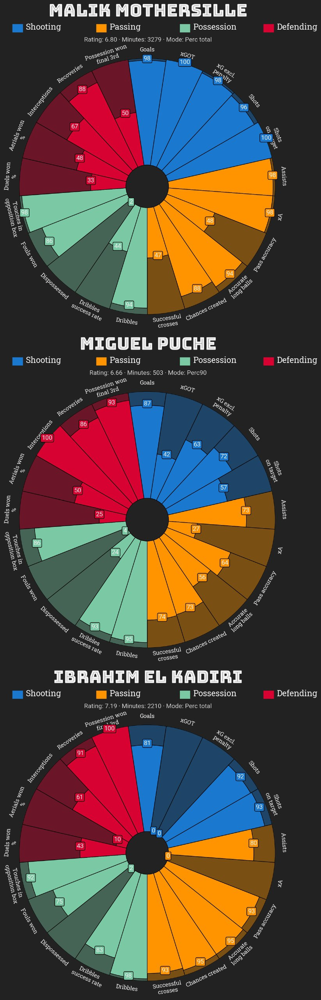

# ScoutingInteligenteBot  
Sistema multiagente basado en RAG para scouting futbolístico  


<p align="center">
    
</p>

---

## 📌 Descripción general
Este proyecto implementa un **bot de Telegram** para *scouting* futbolístico, capaz de responder consultas en lenguaje natural sobre una base de 14476 jugadores (porteros: 1444, jugadores: 13032).  
El sistema se basa en una **arquitectura multiagente orquestada en LangGraph**, que combina recuperación de información con generación aumentada (**RAG**).  

El pipeline completo:
1. Recupera candidatos (FAISS + embeddings).  
2. Aplica filtros restrictivos (edad, valor de mercado, posición, contrato…).  
3. Evalúa y puntúa candidatos en métricas clave derivadas de la query.  
4. Explica los resultados en lenguaje natural.  
5. Devuelve gráficos comparativos y perfiles individuales.  

---

## 🗂️ Estructura del repositorio

```text
proyectosjg/
├── data/                 # Datos brutos y procesados
│   ├── processed/
│   │   ├── merged/       # Bases combinadas (jugadores / porteros)
│   │   └── indices/      # Índices FAISS + metadata
├── src/                  # Código fuente
│   ├── scouting/
│   │   ├── etl/          # Scripts ETL (extracción, merge, indexado)
│   │   ├── agents/       # Implementación de agentes 0–4
│   │   └── telegram/     # Entrypoint del bot
├── figuras/              # Imágenes usadas en README
├── .env.example          # Ejemplo de variables de entorno
├── docker-compose.yml    # Orquestación de servicios
├── Dockerfile            # Imagen base
├── pyproject.toml        # Dependencias
└── README.md             # Este archivo
```

---

## ⚙️ Requisitos
- **Docker Desktop** (Windows requiere WSL2 habilitado).  
- Claves necesarias:
  - `OPENAI_API_KEY`  
  - `TELEGRAM_BOT_TOKEN`  

---

## 🚀 Configuración rápida

1. **Clonar repo y entorno**
```bash
   git clone https://github.com/Scouting-Inteligente-Bot/ScoutingInteligenteBot.git
   cd ScoutingInteligenteBot
   cp .env.example .env
   # editar .env con tus claves
```
2. **Construir imágenes**
```bash
   docker compose build --no-cache --pull
```

3. **Estructura de datos (no versionada)**

```text
data/
├─ processed/
│  ├─ merged/
│  │  ├─ db_jugadores.json
│  │  └─ db_porteros.json
│  └─ indices/
│     ├─ faiss_jugadores.index
│     ├─ faiss_porteros.index
│     ├─ metadata_jugadores.json
│     └─ metadata_porteros.json
```

---


## ETL (Extract, Transform, Load)
Se generan las bases de datos de jugadores de fotmob y de transfermarkt.

### Collect
En esta fase del ETL se recolectan los datos de las distintas bases, en nuestro caso se usa Fotmob para la extracción de estadísticas de los jugadores y
transfermarkt para información contractual, trayectoria, históricos y valor del jugador

Para generar la de FotMob hacemos: 
```bash
docker compose run --rm etl python -m scouting.etl.collect_fotmob
```
El caso de FotMob tiene otra particularidad y es que para hacer uso de sus APIs para obtener los datos de estadísticas de los jugadores tenemos que tener actualizada la variable `X_MAS_TOKEN` que se encuentra en `.env`, para obtener el valor actual hay que ir a fotmob, se coge un ejemplo cualquiera, como Dean Huijsen, y se hace click derecho en donde sea->Inspeccionar->Network->Fetch/XHR y cuando hagamos click en cualquier zona, por ejemplo nombre del jugador, en metrics aparecerá currency, clicamos y bajamos entre esas variables, hasta la última que se llama X-Mas, entonces copiamos ese código, y actualizamos nuestra variable `X_MAS_TOKEN` en `.env` sin usar comillas ni nada.
**ESTO ES INDISPENSABLE HACERLO CADA VEZ QUE SE QUIERA ACTUALIZAR LA BASE DE FOTMOB**

Para transfermarkt:

```bash
docker compose run --rm etl python -m scouting.etl.collect_transfermarkt
```

### Merge
Para poder usar estos datos, tenemos hacer el merge de estas dos bases, para tener nuestra db combinada y separada en jugadores y porteros:


```bash
    docker compose run --rm etl python -m scouting.etl.merge
```

### Indexado (ETL)
Genera FAISS y metadatos desde data/processed/merged hacia data/processed/indices/current:
```bash
    docker compose run --rm etl python -m scouting.etl.vector_store_indexing
```

Salida esperada:
    data/processed/indices/current/
        faiss_jugadores.index
        faiss_porteros.index
        metadata_jugadores.json
        metadata_porteros.json

### Main_etl
Aqui tenemos la ejecución del main_etl.py completo, aunque con algunos atajos por si no queremos ejecutar todo 
```bash
    docker compose run --rm etl python -m scouting.etl.main_etl
```

Tenemos estos 3 atajos para añadir al comando previo por si quisieramos saltarnos alguna fase: --skip-fotmob --skip-tm --skip-merge 
Con estos podremos saltarnos la recolección de fotmob o la de transfermarkt, ambas, y además también el merge de estas y pasar directo al indexado, o bien podemos hacerlo entero.   

Para entender cómo se construye la base de datos combinada a partir de **FotMob** y **Transfermarkt**, se incluye un esquema visual del pipeline ETL:

<p align="center">
  
</p>

---


## 🧩 Arquitectura multiagente

El corazón del sistema está en la carpeta `src/scouting/agents/`, donde cada archivo implementa un **agente especializado** dentro del pipeline orquestado en **LangGraph**.  

Estructura:

```text
src/scouting/agents/
├── agent0.py        # Vector Retriever
├── agent1.py        # Hard Filter
├── agent2.py        # Score Evaluator
├── agent3.py        # Explanation (LLM)
├── agent4.py        # Graph Comparison
├── common.py        # Funciones y utilidades compartidas
├── pipeline.py      # Definición del grafo multiagente con LangGraph
└── telegram_bot.py  # Interfaz de entrada/salida con Telegram
```

### 🧠 Agente 0 — Vector Retriever (`agent0.py`)

**Función principal:**  
Recupera los *k* jugadores más cercanos a la *query* en el espacio de embeddings y devuelve un **DataFrame de Polars** con toda la información estructurada.

**Características clave:**
- Usa el modelo `intfloat/multilingual-e5-base` (SentenceTransformers).
- Busca en índices **FAISS** separados para jugadores y porteros.
- Detecta automáticamente si la consulta es de *jugadores de campo* o *porteros* (palabras clave como “portero”, “goalkeeper”…).
- Normaliza los metadatos complejos (`estadísticas`, `rasgos`, `contratos`) en formato JSON seguro para Polars.
- Recupera por defecto los **3500 más cercanos**, configurables en `top_k`.

**Entradas:**  
- `query_norm`: texto libre del usuario normalizado y traducido a español si fuera necesario.  
- `tipo`: (opcional) forzar búsqueda en `jugador` o `portero`.

**Salidas:**  
- `pl.DataFrame` con los jugadores más cercanos.  
- `tipo` utilizado finalmente.

**Ejemplo de uso en el pipeline:**
```python
from scouting.agents.agent0 import Agente0VectorRetriever

agent0 = Agente0VectorRetriever(top_k=3500)
df, tipo = agent0.recuperar("extremo joven habilidoso")
```
Este DataFrame es la base para los siguientes agentes: primero se filtra (Agente 1), después se puntúa (Agente 2).

- **Agente 1 – Hard Filter**
### 🧱 Agente 1 — Hard Filter (`agent1.py`)

**Función principal:**  
Aplica **filtros restrictivos** derivados de la query para reducir el universo devuelto por el Agente 0 a los candidatos que cumplen las condiciones explícitas.

**Características clave:**
- **Parsing robusto** de la query (normaliza tildes, símbolos y alias).
- Filtros soportados:
  - **Edad** (rangos, `<`, `≤`, `sub-23`, “joven”, “veterano”…).
  - **Valor de mercado** (euros, `k`, `M`, “millones”, “barato/asequible”…).
  - **Posición** (mapa amplio de sinónimos: *extremo/winger, pivote, central, lateral…* + laterales/alas por banda).
  - **Pie dominante** (zurdo/diestro/ambidiestro).
  - **Altura** (`m` o `cm`, además de descriptores “alto/bajo”).
  - **Contrato** (años restantes: “menos de 2 años de contrato”).
  - **Nacionalidad** (gentilicios y alias normalizados a país canónico).
  - **Liga explícita** (alias → nombre canónico) y **país de la liga** (con reconciliación liga↔país).
- **Normalización de columnas** para Polars (renombra si vienen como `posicion/position`, `valor_mercado`, etc.).
- Convierte campos complejos (p. ej. `other_positions`) desde *JSON/string → list[str]*.
- Logs `DEBUG` opcionales para trazar qué filtros se aplicaron y cómo afectaron al tamaño del DF.

**Entradas:**  
- `df_pre_filtrado: pl.DataFrame` (salida del Agente 0).  
- `query_norm`: texto libre del usuario normalizado y traducido a español si fuera necesario.  
- `tipo: "jugador" | "portero"`.

**Salidas:**  
- `pl.DataFrame` filtrado (mismo esquema, menos filas).  
- `tipo` (propagado).

**Ejemplo de uso en el pipeline:**
```python
from scouting.agents.agent1 import Agente1HardFilter

a1 = Agente1HardFilter()
df_filtrado, tipo = a1.filtrar(df_pre, "extremo izquierdo sub23, zurdo, < 2M, menos de 2 años de contrato", "jugador")
```
El resultado queda listo para el Agente 2, que calculará el scoring sobre este subconjunto ya depurado.

### 📊 Agente 2 — Score Evaluator (`agent2.py`)

**Función principal**  
Selecciona **8 métricas clave** alineadas con la *query* y calcula un **score final por jugador/portero**, ajustado por **minutos** y **nivel de liga**. Devuelve el **Top-3** ordenado y un DF con esos jugadores.

**Cómo decide las 8 métricas**
- Combina **dos señales**:
  1) **Intents semánticos** (p. ej., *desborde, centros, finalización, duelos, presión…* / para GK: *paradas, juego aéreo, salida de balón…*) mapeados a métricas con pesos.  
  2) **Similitud por embeddings** entre la query y las **descripciones de cada estadística**.
- Fusión ponderada (intents 70% + embeddings 30%), limpieza de **métricas redundantes/conflictivas** (p. ej., *Duels won* vs *Duels won %*), y refuerzo de **bloques** si la query lo sugiere (Shooting/Passing/Possession/Defending).
- Si la query menciona explícitos como “regate”, “centros”, “duelos” o “gol”, estas familias reciben **boost** y entran antes en los 8 *slots*.

**Tratamiento de minutos**
- Filtro mínimo por minutos (por defecto: **≥500** jugadores, **≥0** porteros; configurable desde la query, p. ej. “sin restricción de minutos” o “≥800 min”).  
- Si el jugador tiene **< 750 min**, se **prioriza per90** en el cómputo del score.

**Cálculo del score por métrica**
- Para cada métrica seleccionada:  
  - Combina **percentil**, **percentil/90**, **valor** y **valor/90** (más peso al percentil; si <750 min, más peso a **/90**).  
  - Métricas donde **menor es mejor** (*Dispossessed, Fouls committed, Dribbled past, Goals conceded…*) ignoran el valor bruto.
- El **score total** es la suma de los ponderados por los **pesos de las 8 métricas** (renormalizados a 1).

**Ajuste por liga**
- Multiplica el score por un **coeficiente de liga** (Big-5 ≈ 1.00; ligas menores < 1) para **equiparar dificultad competitiva**.

**Entradas:**  
- `df_filtrado: pl.DataFrame` (salida del Agente 1).  
- `query_norm`: texto libre del usuario normalizado y traducido a español si fuera necesario.  
- `tipo: "jugador" | "portero"`.

**Salidas**
- `resultados[:3]` → lista de 3 dicts con: `score`, `metricas_clave`, `detalle` por métrica, `minutes_real`, `nivel_liga`, rasgos, etc.  
- `df_top3` → DataFrame Polars con las filas de los 3 mejores.

**Ejemplo de uso en el pipeline**
```python
from scouting.agents.agent2 import ScoreEvaluatorAgent

a2 = ScoreEvaluatorAgent()
top3, df_top3 = a2.score_dataframe(df_filtrado, "extremo izquierdo habilidoso con regate y gol", "jugador")
```
Esta salida alimenta al Agente 3 (explicación en lenguaje natural) y al Agente 4 (gráficos).

### 🧠 Agente 3 — Explanation (`agent3.py`)

**Función principal**  
Genera una **explicación profesional en lenguaje natural** (idioma de la query) que justifica por qué los 3 jugadores del Agente 2 encajan con la búsqueda. Usa un **system prompt asistente experto en análisis futbolístico** + *few-shot* y compone un texto con datos clave (edad, posición, minutos, pie, altura, valor, contrato, score) y **lectura de métricas** (percentil y por-90).

**Entradas**
- `query` (str): petición del usuario sin normalizar y en idioma original.
- `resultados` (List[dict]): salida del Agente 2 con `metricas_clave`, `detalle` por métrica, `minutes_real`, `nivel_liga`, `liga`/`liga_stats`/`temporada_stats`, `años_contrato`, `rasgos`, etc.

**Cómo construye la explicación**
- **Plantilla de sistema** con reglas de estilo y exactitud (no reasignar posición, interpretar métricas “negativas”: *Dispossessed*, *Dribbled past*, *Fouls committed*, y que un percentil alto siempre es bueno).
- **Formateo previo**: ordena métricas por **peso**, muestra percentiles y **prioriza per90** si `minutes_real < 750`.  
- **Contrato**: traduce años restantes a señal de **disponibilidad/coste**.  
- **Liga vs. liga_stats**: añade nota cuando las estadísticas provienen de otra liga/temporada.  
- **Rasgos**: resalta los que son ≥ 75 como fortalezas.

**Salida**
- `str` con un informe claro (3 bloques, uno por jugador) listo para enviar por Telegram.

**Ejemplo de uso en el pipeline**
```python
from scouting.agents.agent3 import Agente3Explanation

a3 = Agente3Explanation(model="gpt-4o-mini", lang="es")
texto = a3.explicar_resultados(query, resultados_top3)
# → cadena con el análisis para Telegram
```
**Notas de implementación**
- Modelo por defecto: `gpt-4o-mini`, `temperature=0.35`.
- No inventa campos: si faltan datos en `resultados`, se omiten.
- Mantiene la posición **principal**  tal cual; si el encaje es por posición secundaria, lo advierte.

### 📊 Agente 4 — Graph Comparison (`agent4.py`)

**Función principal**  
Genera las **visualizaciones** del sistema:
1) **Dos radares Plotly** (percentil total y percentil por 90’) para los 3 candidatos del Agente 2.  
2) **Collage de player radars de perfil** (MPLSoccer) por bloques estadísticos, con reglas que **adaptan las métricas** al rol (ofensivo / medio / defensa / portero).

**Entradas**
- `resultados` (List[dict], tamaño 3): salida del Agente 2 con `metricas_clave` y `detalle[stat].raw` (incluye `percentile` y `percentile_per90`), `nombre`, `main_position`, `estadísticas`, `Minutes`, `Rating`, etc.
- `out_dir` (str): carpeta donde guardar imágenes.

**Qué produce**
- `graph_comparison(resultados) -> (fig1, fig2)`: dos `go.Figure` (radares de **percentiles totales** y **per90**).
- `build_radar_collage(resultados, out_dir, filename="radars_collage.png") -> str`: PNG con ambos radares maquetados y **leyenda grande** a la derecha.
- `build_pizza_collage(resultados, out_dir, filename_collage="profiles_comparison.png", layout="column") -> (jpg_collage, [png_individuales])`:  
  - 1 **collage** (JPG) con 3 player radars (uno por jugador)  
  - y, opcionalmente, **PNG individuales** por jugador.

**Detalles relevantes**
- **Per90 inteligente**: si `Minutes` < umbral (por defecto 1000), la pizza usa `percentile_per90`.  
- **Bloques y colores**  
  - Jugadores: `Shooting` (azul), `Passing` (naranja), `Possession` (verde agua), `Defending` (rojo).  
  - Porteros: `Goalkeeping` (azul) y `Distribution` (naranja).  
- **Selección de métricas** por bloque:
  - Se cubren listas fijas (p. ej., `Successful crosses`, `xG excl. penalty`, `Duels won %`, `High claims`, …).  
  - En **Possession** se alterna `Touches in opposition box` (ofensivos) o `Touches` (resto).  
  - En **Defending** se añaden extras por rol (p. ej., `Dribbled past` para laterales/CM; `Blocked scoring attempt` para CB/DM; `Possession won final 3rd` para ofensivos).
- **Robustez I/O**: soporta `estadísticas` como `dict` o `str` (JSON / dict-like). Limita tamaño final (**máx. 3840 px**) para envío en Telegram.
- **Dependencias opcionales**: si `mplsoccer`/`Pillow` no están, se **omiten pizzas** y solo se generan radares Plotly.

**Ejemplo de uso en el pipeline**
```python
from scouting.agents.agent4 import GraphComparisonAgent

a4 = GraphComparisonAgent(per90_minutes_threshold=1000)

# 1) Radares separados (si quieres mostrarlos en notebook o exportarlos tú)
fig_total, fig_per90 = a4.graph_comparison(resultados_top3)

# 2) Collage compacto con ambos radares (PNG listo para Telegram)
path_radars = a4.build_radar_collage(resultados_top3, out_dir="/data/figs")

# 3) Player radars de perfil jugadores (collage JPG + PNG individuales)
collage_fp, pngs = a4.build_pizza_collage(resultados_top3, out_dir="/data/figs", layout="column")
```
**Consejos**
- Si el radar sale con muchas etiquetas, reduce metricas_clave en el Agente 2 (p. ej., top-6), si se quieren más también se puede ampliar.
- Para README/Telegram, el collage para los radares comparativos es más legible que dos imágenes separadas.

### 🧰 Utilidades comunes (`common.py`)

Pequeño módulo de **infraestructura** compartida:

- **Carga de entorno**  
  `load_dotenv()` permite leer variables desde `.env` sin esfuerzo.

- **Logging JSON a stdout**  
  Configura `logging` en **stdout** y expone `jlog(event, **kw)` para emitir líneas JSON (útiles en Docker/CloudWatch).
  ```python
  from scouting.agents.common import jlog
  jlog("agent0_init", base="/data/processed/indices/current")
  # => {"ts":"2025-09-11T10:45:12Z","event":"agent0_init","base":"..."}
    ```

**Helpers de entorno (valores por defecto seguros)**
- `env_str(key, default="")` → `str`
- `env_int(key, default)` → `int` con fallback
- `get_indices_dir()` → `data/processed/indices/current` por defecto
- `get_openai_model_supervisor()` → `"gpt-4o-mini"`
- `get_openai_key()` y `get_telegram_token()` → extraen **secrets** del entorno

**Uso típico**
```python
from scouting.agents.common import (
  jlog, get_indices_dir, get_openai_model_supervisor, get_telegram_token
)

indices_dir = get_indices_dir()
model_sup   = get_openai_model_supervisor()
jlog("startup", indices_dir=indices_dir, model=model_sup)
```
**Ventaja**
- Centraliza config y logs estructurados → mismos defaults en local, Docker y CI/CD, y trazas limpias para depurar el pipeline.

### ⚙️ Pipeline (`pipeline.py`)

Define el grafo LangGraph que conecta los agentes y gestiona la salida a Telegram.

#### Flujo principal
1. **Supervisor**  
   - Clasifica la consulta (`ok`/`fin`), detecta idioma y normaliza a español.  
   - Si no es scouting de fútbol → mensaje de rechazo.

2. **Agente0** → Recupera candidatos vía FAISS + tipo (`jugador`/`portero`).  
3. **Agente1** → Filtros duros (edad, valor, posiciones, pie, altura, contrato, nacionalidad, liga).  
4. **Agente2** → Selección de métricas clave (embeddings + reglas), cálculo de score ponderado (percentiles, minutos, coeficiente de liga).  
5. **Agente3** → Explicación razonada (OpenAI, idioma original).  
6. **Agente4** → Gráficos comparativos:
   - Radar collage (totales vs per90)  
   - Collage player radars (perfil por bloques)  
   - Con fallback de imagen en caso de error.  
7. **Send to Telegram** → Envía explicación y gráficos al chat.

#### Estado compartido
`PipelineState`: query, lang, tipo, df_pre_filtrado, df_filtrado, resultados, df_top3, explicacion, chart_paths, chat_id, decision.

#### Integración
```python
from scouting.pipeline import pipeline

state = pipeline.invoke({
  "query": "Extremo izquierdo sub-23 con regate y centros",
  "chat_id": "<ID_TELEGRAM>"
})
```

**Configuración**
- `OPENAI_API_KEY`, `OPENAI_MODEL_SUPERVISOR` (default: gpt-4o)
- `TELEGRAM_BOT_TOKEN` para envío real
- `KAL_CHROME_PATH` opcional (Chrome en Docker/headless)


### 🤖 Telegram bot (`telegram_bot.py`)

Maneja la **entrada/salida con Telegram** mediante *polling* y delega el procesamiento al `pipeline`.

- **Qué hace**
  - Lee el último update con `getUpdates` y usa un *offset* persistido en `/data/last_update_id.txt` para **no repetir mensajes**.
  - Extrae `chat_id` y `text`, y llama a:  
    `pipeline.invoke({"query": text, "chat_id": str(chat_id)})`.
  - Requiere `TELEGRAM_BOT_TOKEN` en `.env`.

- **Ejecución**
```bash
  # Servicio en Docker (recomendado)
  docker compose up -d bot
  docker compose logs -f bot

  # O directo (si tienes entorno local con deps)
  python -m scouting.agents.telegram_bot
```
**Notas**
- Si no hay `BOT_TOKEN`, el bot no se inicia y lo avisa por consola.
- El archivo `/data/last_update_id.txt` se guarda en el volumen `./data:/data` para persistencia entre reinicios.
- El envío al usuario lo hace el propio `pipeline` en su nodo `nodo_send_to_telegram` (texto + imágenes).

El flujo multiagente completo —desde la query hasta la explicación y gráficos enviados a Telegram— sigue este grafo:

<p align="center">
  
</p>

---

## Ejecutar el bot
```bash
    docker compose up -d bot
    docker compose logs -f bot
```

- El bot usa polling con offset, guardado en /data/last_update_id.txt.

- En Telegram, envía consultas como:

> *“Extremo izquierdo joven, habilidoso, con regate y gol. Precio máximo 500k”*  

## Variables de Entorno

- `OPENAI_API_KEY` — clave de OpenAI
- `TELEGRAM_BOT_TOKEN` — token del bot
- `OPENAI_MODEL_SUPERVISOR` — default: `gpt-4o`
- `INDICES_DIR` — default: `/data/processed/indices/current`
- `KAL_CHROME_PATH` — default: `/usr/bin/google-chrome-stable` (necesario para PNG)

## Troubleshooting
- **No genera PNG / error Kaleido**
  Asegúrate de que el contenedor bot tiene Chrome:
```bash
   docker compose exec bot sh -lc 'which google-chrome-stable || which google-chrome || which chromium || which chromium-browser'
```
Si no existe, reconstruye la imagen del bot con el bloque de instalación de Chrome en su Dockerfile.

- **El bot repite el mismo mensaje**
    Verifica que existe `/data/last_update_id.txt` y que el volumen `./data:/data` está montado.

- **No filtra nada**
    Revisa que `metadata_*.json` tengan estructura con info completo (posición, pie, altura, valor, contrato…).

- **WSL/Engine colgado (windows)**
```bash 
    wsl --shutdown
    #y vuelve a abrir Docker Desktop.
```

---     

## Seguridad
- No se *commitean* `.env` ni `data/`.

---

## 🖼️ Demo del bot
Ejemplo real de interacción vía Telegram con el bot de scouting:

<p align="center">
  
</p>


<p align="center">
  
</p>

<p align="center">
  
</p>

En la demo se observa cómo una consulta en lenguaje natural se transforma en:
1. **Explicación razonada** de los 3 jugadores más relevantes.  
2. **Gráficos comparativos** (radar y perfiles tipo player radar) generados automáticamente.  

